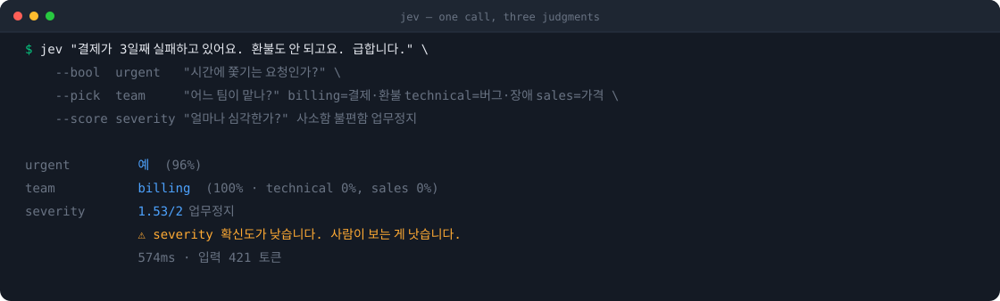

<h1 align="center">jev</h1>
<p align="center"><b>Stop burning LLM tokens on yes/no calls.</b></p>
<p align="center">
  <a href="README.ko.md">한국어</a> ·
  <a href="#install">Install</a> ·
  <a href="#usage">Usage</a> ·
  <a href="#troubleshooting">Troubleshooting</a>
</p>

Your agent makes narrow judgments all day long — *is this file relevant? is this test
failure a flake? which bucket does this go in?* Every one of those is an LLM call, tokens,
and seconds.

[jev](https://typesafe.ai/blog/introducing-system-one-models-and-jev) doesn't generate text.
It returns a **typed value with a calibrated confidence**, in about **$0.00004 and 300–500ms**.



Three questions, **one call, one charge**.

## Why not just ask the LLM

| | Asking the LLM | jev |
|---|---|---|
| Answer | Prose — *"this looks probably relevant"* | A typed value plus probabilities |
| Confidence | None. It always sounds sure | Calibrated `confidence` |
| Speed | 2–10s | 300–500ms |
| Cost | The judgment can cost more than the work | $0.042 / 1M input tokens, output free |
| Shape | You parse it. Sometimes it breaks | Always the same shape |

Need the auth-related files out of 184?

```bash
git ls-files | jev --batch --bool relevant "Is this file part of the auth logic?"
```

```json
{"input":"src/auth/session.ts","relevant":true}
{"input":"README.md","relevant":false}
```

Your agent reads 12 files instead of 184 — and never had to guess.

## Measured

Not estimates. Both paths run through the same gateway, so the billing numbers come
straight out of the responses. The script and the inputs are in [`bench/`](bench/) —
re-run it yourself.

**20 Korean support tickets → which team, and is it urgent.**

| | Calls | Input tok | Output tok | Cost | Agreement |
|---|---:|---:|---:|---:|---:|
| **jev** | 20 | 7,961 | 1,100 | **$0.000334** | — |
| `openai/gpt-5.2`, all 20 in one prompt | 1 | 457 | 166 | $0.003124 | 18/20 |

**9.3× cheaper**, against the LLM's *best* case — one batched call, no per-item overhead.
Per judgment jev came to **$0.0000167** and **~500ms**.

jev spends **17× more tokens** and still costs a tenth as much: its input tokens are
about **160× cheaper**, and its output is free. Sending each item separately, with the
full question spec each time, is the cheap thing to do here.

### What this doesn't show

- **The batched LLM is faster in wall-clock time.** One call answered all 20 in ~2.1s.
  If your items all fit in one prompt and you don't mind parsing the result, speed is
  not the reason to reach for jev — cost, a fixed output shape, and calibrated
  confidence are.
- **Free-tier rate limits hit both.** Under sustained concurrency both jev and the chat
  models returned 429. The benchmark runs sequentially so limits don't contaminate the
  comparison.
- **Neither side is ground truth.** 18/20 agreement means they differed on two tickets,
  not that either was right.

```bash
AI_GATEWAY_API_KEY=... node bench/run.mjs openai/gpt-5.2 2
```

## What it includes

| | |
|---|---|
| `skills/jev/SKILL.md` | When to delegate and when not to. This is the skill |
| `skills/jev/jev.mjs` | CLI and library. **One file, zero dependencies** |

Copy the skill directory anywhere and it works. No build step, no `npm install` —
just Node 20+ and its built-in `fetch`.

## Install

jev ships as a portable [Agent Plugin](https://agent-plugins.org) — one `plugin.json`,
one `skills/` directory. Codex and Claude Code install the same files.

### Get a key

Either one works. Both are plain HTTPS — neither adds a dependency.

| | Where |
|---|---|
| `TYPESAFE_API_KEY` | [console.typesafe.ai/keys](https://console.typesafe.ai/keys) |
| `AI_GATEWAY_API_KEY` | [vercel.com/ai-gateway](https://vercel.com/ai-gateway) — starts with `vck_` |

If you already have a Vercel account the second one is faster; AI Gateway serves jev on
the free tier. With both set, jev calls TypeSafe directly.

#### Put it in `~/.zshenv`, not `~/.zshrc`

This is where most people get stuck.

```bash
echo 'export AI_GATEWAY_API_KEY="vck_..."' >> ~/.zshenv
```

zsh reads each file under different conditions:

| File | Read by |
|---|---|
| `~/.zshrc` | **Interactive shells only** — the terminal you type into |
| `~/.zprofile` | Login shells only |
| **`~/.zshenv`** | **Every zsh** — including the non-interactive shell your agent uses |

Agents run commands in a **non-interactive** shell. Put the key in `~/.zshrc` and
`echo $AI_GATEWAY_API_KEY` prints it in your terminal while the agent keeps reporting
*"no API key"*.

On bash, use `~/.bashrc`, and add `~/.profile` too if the same symptom shows up.

#### Restart the agent

A running process never sees an environment variable that changed after it started.
The macOS desktop app does not quit when you close the window — **⌘Q**, then reopen.

#### Verify

```bash
jev --doctor
```

```text
키          ✓ AI_GATEWAY_API_KEY (60자)
백엔드      Vercel AI Gateway 경유
연결        ✓ 588ms
```

### Codex

```bash
codex plugin marketplace add heyman333/jev-skill
```

Then pick `jev` in the plugin browser with `/plugins`. Or drop the directory in by hand:

```bash
mkdir -p ~/.agents/skills && cp -r skills/jev ~/.agents/skills/     # every project
mkdir -p .agents/skills && cp -r skills/jev .agents/skills/         # this repo only
```

Codex picks it up next session. Ask it to classify or filter something and it applies on
its own; to force it, type `$jev`.

### Claude Code

```text
/plugin marketplace add heyman333/jev-skill
/plugin install jev@jev-skill
```

The default scope is **user** — all of *your* projects, nothing written to the repo.
Narrow or widen it with `--scope`:

```bash
# just me, just this project (.claude/settings.local.json — auto-gitignored)
claude plugin install jev@jev-skill --scope local

# the whole team on this project (.claude/settings.json — commit it)
claude plugin install jev@jev-skill --scope project
```

Updating — refresh the marketplace first, then the plugin, then restart:

```text
/plugin marketplace update jev-skill
/plugin update jev@jev-skill
```

Or copy the skill by hand into `~/.claude/skills/` or `<project>/.claude/skills/`.

### Cursor, Gemini CLI, anything else

The skill is one Markdown file and one Node script with no agent-specific dependencies.
Point your `AGENTS.md` or `.cursor/rules` at `skills/jev/SKILL.md` and it works.

## Usage

Once installed, your agent reaches for it on its own.

```text
> pick out the auth-related files in this repo
> of these failing tests, which are real bugs
> sort these issues into buckets
```

Or call it directly:

```
jev "<what to judge>" --bool  <id> "<question>"
jev "<what to judge>" --pick  <id> "<question>" <option>[=description] ...
jev "<what to judge>" --score <id> "<question>" <lowest> ... <highest>
cat items.txt | jev --batch --bool <id> "<question>"
```

| Flag | |
|---|---|
| `--batch` | One item per stdin line, same questions. JSONL out, **input order preserved** |
| `--file <path>` | Read the subject from a file |
| `--json` | Full response including probability distributions |
| `--quiet` | Values only — for shell pipelines |
| `--concurrency N` | Parallel batch requests (default 8) |
| `--doctor` | Diagnose why the key isn't picked up. **Never prints the key** |

A failing item in a batch doesn't take the rest down; that line comes back as
`{"error":...}`.

As a shell gate:

```bash
if [ "$(jev "$(git log -1 --format=%B)" --quiet \
        --bool ok "Does this commit message explain what changed and why?")" = "false" ]; then
  echo "Rewrite the commit message"; exit 1
fi
```

## Question wording decides accuracy

**jev is never wrong.** Ask a vague question and you don't get a vague answer — you get a
**confidently wrong** one.

A real one from building this. Asked how hard the task *"classify 100,000 reviews"* was,
jev answered **1.55/2**. Classifying one review is trivial — it had read the **volume as
difficulty**. Adding *"judge ONE item; ignore how many there are"* moved it to **0.21**.

- Bad: `"Is this task hard?"`
- Good: `"Is handling ONE of these items hard? Ignore the total count."`

Describe your options. `billing=charges, refunds, invoices` beats `billing`.

## Low confidence stops the line

`--pick` and `--score` return `confidence`. Under 60% the CLI says so.

```text
team           billing  (71% · technical 14%, sales 14%)
               ⚠ team 확신도가 낮습니다. 사람이 보는 게 낫습니다.
```

The skill is told not to quietly take the top answer here — show the candidates or read
that one item directly. **An LLM sounds certain even when it isn't.** jev hands you the number.

## Troubleshooting

### The key isn't picked up

```bash
jev --doctor
```

It finds which config file holds the key and tells you the cause and the fix.
**It never prints the key** — only its length and whether it's there.

> **Don't check with `echo $AI_GATEWAY_API_KEY`.** The value lands in your terminal and
> your logs. `${VAR:-none}` is not masking either — if the variable is set, it prints the value.

### It works in my terminal but not in the agent

The key is in `~/.zshrc`. Agents use a non-interactive shell, which doesn't read that file.
Move it to `~/.zshenv`. If other `~/.zshrc` variables (`NVM_DIR`, say) are also missing,
that confirms it.

### I updated the plugin but the old behavior persists

The plugin cache doesn't refresh on its own. Update the marketplace first, then the
plugin, then restart the agent.

```bash
grep -c zshenv ~/.claude/plugins/cache/jev-skill/jev/*/skills/jev/jev.mjs
```

### The low-confidence warning keeps firing

The question is ambiguous. Describe your options
(`billing=charges, refunds, invoices`) and say *"judge ONE item"* for batch work.
See [Question wording decides accuracy](#question-wording-decides-accuracy).

## Limits

- **It can't make anything.** Writing code or prose is still the LLM's job. jev only judges.
- **It can't explain itself.** No *"why did you decide that"* — just probabilities.
- **It can't see past the text you hand it.** Read the file first, then pass the content.
- **One-offs aren't worth it.** The round trip costs more than the judgment saves.

## Repo layout

```text
plugin.json                  # portable manifest (Agent Plugins 1.0) — the source of truth
.codex-plugin/               # Codex manifest
.claude-plugin/              # Claude Code manifest + marketplace catalog
.agents/plugins/             # Codex marketplace catalog
.agents/skills/jev -> ../../skills/jev    # a symlink, not a copy
skills/jev/                  # the skill — SKILL.md, jev.mjs
scripts/check-manifests.mjs  # six manifests, one name and one version
scripts/build-demo-svg.mjs   # docs/demo.svg is generated from real CLI output
bench/                       # the head-to-head benchmark behind the Measured section
```

Both runtimes load the same `skills/`. The skill is never forked per agent.

## Development

```bash
npm test      # spawns a mock server and drives the CLI over real HTTP. No dependencies
npm run check # manifest name and version agreement
```

Bumping the version means editing five files. `npm run check` catches any drift.

## License

MIT
